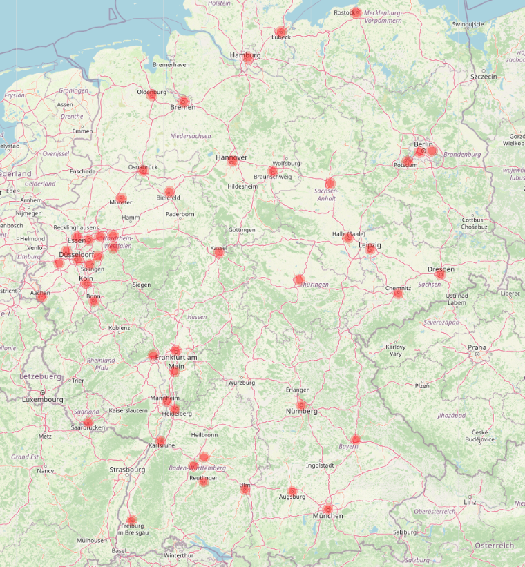
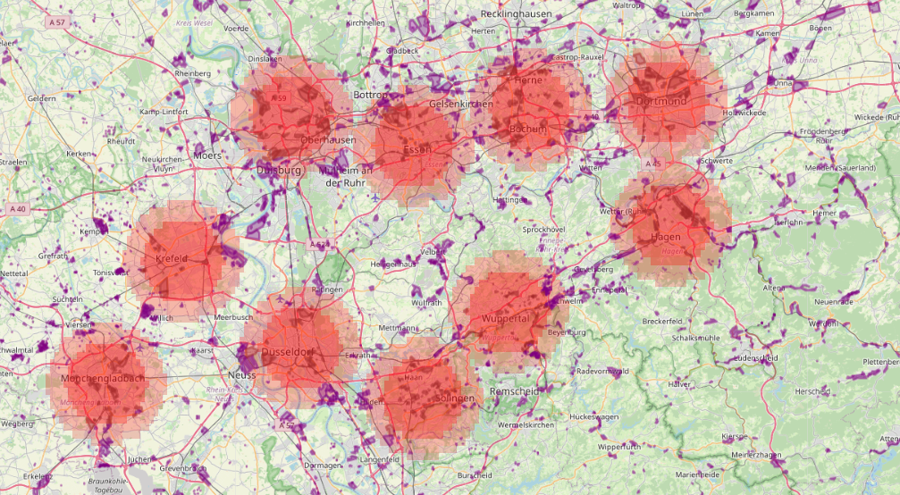

# Population-Loss-NW
Estimate fatalities and loss of industry in the direct aftermath of a nuclear war

## Installation
1. Clone the repo on your local machine.
2. Create the Conda environment using `conda env create -f environment.yml`.
3. Activate the new environment using `conda activate Population-Loss-NW`.
4. (Optional) Download the `.osm` data to the `data/OSM` directory if you want to use the industrial loss option. It can be downloaded [here](https://drive.google.com/drive/folders/13g6QluVBuEs9fm-nOPzuiYNYdXzB1WiK?usp=drive_link). For more countries, additional files can also be generated using the `data/OSM/extract-industrial-country.sh` script.
5. (Optional) Download the HD LandScan data to the `data/LandScan` directory if you want to use the HD version of the LandScan data. It can be downloaded [here](https://landscan.ornl.gov/).

## Methodology
Here we use the methodology of [Toon et al. 2007](https://acp.copernicus.org/articles/7/1973/2007/acp-7-1973-2007.pdf) and [Toon et al. 2008](https://pubs.aip.org/physicstoday/article/61/12/37/393240/Environmental-consequences-of-nuclear-warA) to estimate the number of fatalities in the aftermath of a nuclear war.

In Hiroshima and Nagasaki data a normal distribution around ground zero was measured for the fatality rate, $\alpha(R) = e^{-\frac{R^2}{2 \sigma^2}}$, where $R$ is the distance from ground zero and $\sigma=1.15$ km for a 15 kt airburst. Following Toon et al. 2008, the width of this distribution is assumed to scale as $\sqrt{\frac{Y}{15\,{\rm kt}}}$, where $Y$ is the yield of the nuclear weapon. This is so that the area with a given $\alpha(R)$ contours scales linearly with $Y$. Note that this excludes fatalities related to radioactive fallout, which depends on a number of hard to predict factors (sheltering, evacuation, weather, etc.). Note that I actually scale using an average of Hiroshima and Nagasaki yields (so 18 kt), which is different from Toon et al. but more defensible.

Using [LandScan](https://landscan.ornl.gov/) data for population, we can estimate the number of fatalities in the immediate aftermath of a nuclear war by integrating over the distribution of distances from ground zero.

Targets can be selected by finding for a given country where to detonate a given number of warheads over the country's most populated region and without overlapping targets (following the Toon et al. methodology). For example, here are the results for 50 100-kt non-overlapping strikes on Germany. The areas colored in light red are regions where fatalities are expected from the blasts and ensuing fires and those colored in dark red are regions expected to be burned down (there are different possible assumptions here: see `scripts/burn-radius-scaling.ipynb`). 14 million fatalities are expected in this scenario. Other targeting options currently supported are to maximize the number of fatalities while allowing overlapping targets, and defining the coordinates of the targets (along with a CEP to account for targeting inaccuracy).

 

In addition, industrial zones can be shown in purple or brown if they are burned down by the nuclear explosions. This allows to estimate the loss of industry in the aftermath of a nuclear war by calculating for a given country what fraction of all industrial areas are burned down.

 

Finally, we also calculate the amount of soot emissions in Tg as in [Toon et al. 2008](https://pubs.aip.org/physicstoday/article/61/12/37/393240/Environmental-consequences-of-nuclear-warA)

Note that other targeting options are also supported. Currently, there is an option for following the [OPEN-RISOP](https://github.com/davidteter/OPEN-RISOP/tree/main/TARGET%20LAYDOWNS) target list for the US, and an option for following the [declassified 1956 US target list](https://futureoflife.org/resource/us-nuclear-targets/) for Russia and China.

## Data sources
* [LandScan](https://landscan.ornl.gov/) for population data
* [OSM](https://download.geofabrik.de/) for industrial data

## Limitations
* Nuclear fallout is not considered.
* The code requires quite a bit of RAM if the target country is large. If this is an issue, you can use the `degrade` option to degrade the resolution of the LandScan data. The original resolution is 30 arc-seconds, so the individual pixels are somewhat smaller than 1 km² for the regions most susceptible to nuclear war.
* Targeting only counter-value targets is not realistic: we should eventually consider counter-force targets as well.

## Codebase orientation
Simply use `scripts/master.ipynb` to calculate the number of fatalities and destruction of industrial capacity in a nuclear war given an attack with a given number of warheads against a given country. All the code is in `src/main.py`. `results` contains the number of fatalities and loss of industrial capacity for different scenarios.

`scripts/HEMP.ipynb` contains the standalone code to calculate the disablement of industrial capacity due to HEMP. For the scenarios currently considered, EMP effects can be applied separately from the effects of direct destruction of industrial capacity. However, this could change in the future, which would necessitate a more integrated approach. This was avoided at this stage to keep the codebase simple.

## Verification
To verify that the implementation is correct, we can compare to the [results](https://pubs.aip.org/view-large/figure/45882429/37_1_f1.jpg) of Toon et al. Below is a comparison between the number of casualties (in millions) in different scenarios. Note that this includes fatalities and injuries to facilitate the comparison with the results of Toon et al. Everything seems to work ok. Some numbers are significantly higher, but this can be attributed to population increase over the years (India in particular). Note that this verification was performed using the same 15 kt base yield as Toon et al. (the default code uses 18 kt).

| Scenario | Toon et al. | This code (Toon assumptions) |
|----------|----------|----------|
| Pakistan, 50x 15kt  | 18   |  22  |
| Pakistan, 200x 100kt  | 50   |  66  |
| UK, 50x 15kt | 6 | 6 |
| UK, 200x 100kt | 28 | 29 |
| Germany, 200x 100kt | 28 | 26 |
| India, 50x 15kt | 26 | 34 |
| India, 200x 100kt | 116 | 172 |
| Japan, 50x 15kt | 13 | 11 |
| Japan, 200x 100kt | 59 | 50 |
| US, 50x 15kt | 8 | 8 |
| US, 1000x 100kt | 104 | 108 |
| Russia, 50x 15kt | 12 | 8 |
| Russia, 1100x 100kt | 76 | 66 |
| China, 50x 15kt | 32 | 24 |
| China, 1100x 100kt | 287 | 314 |
| France, 50x 15kt | 7 | 6 |
| France, 200x 100kt | 23 | 20 |

And here is a similar comparison for the amount of soot emissions in Tg. Note that for the second column in this table we use the same burn radius prescription as Toon et al., which is different from the default code (which scales from an average of Hiroshima and Nagasaki, and accounts from atmospheric absorption of thermal radiation - this is the assumption used in the third column).

| Scenario | Toon et al. | This code (Toon assumptions) | This code (default assumptions) |
|----------|----------|----------|----------|
| France, 200x 100kt | 6.5 | 6.1 | 4.3 |
| Germany, 200x 100kt | 7.3 | 7.2 | 5.1 |
| UK, 200x 100kt | 7.4 | 7.6 | 5.4 |
| India, 200x 100kt | 21.4 |  |  |
| Japan, 200x 100kt | 11.9 |  |  | 
| Pakistan, 200x 100kt | 11.0 |  |  |
| US, 1000x 100kt | 28.1 |  |  |
| Russia, 1100x 100kt | 26.9 |  |  |
| China, 1100x 100kt | 59.5 |  |  |

## Scenarios considered
See the `results` directory for the results of the scenarios considered.

### `Toon2008_SORT`
This scenario is based on [Toon et al. 2008](https://pubs.aip.org/physicstoday/article/61/12/37/393240/Environmental-consequences-of-nuclear-war). In this scenario,  we assume that Russia targets 1000 weapons on the US and 200 warheads each on France, Germany, India, Japan, Pakistan, and the UK. We assume the US targets 1100 weapons each on China and Russia. Targets are selected by finding for a given country where to detonate a given number of warheads over the country's most populated region and without overlapping targets. In this scenario, total fatalities reach 570 million.
