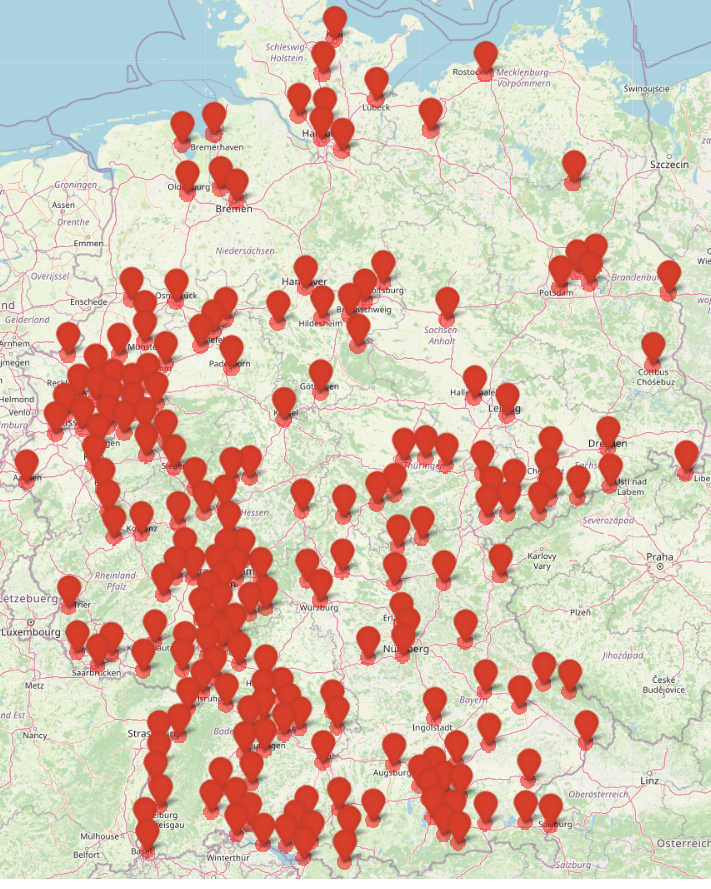

# Population-Loss-NW
Estimate fatalities in the direct aftermath of a nuclear war

## Methodology
Here we use the methodology of [Toon et al. 2007](https://acp.copernicus.org/articles/7/1973/2007/acp-7-1973-2007.pdf) and [Toon et al. 2008](https://pubs.aip.org/physicstoday/article/61/12/37/393240/Environmental-consequences-of-nuclear-warA) to estimate the number of fatalities in the aftermath of a nuclear war.

Hiroshima and Nagasaki data give a normal distribution around ground zero for the fatality rate, $\alpha(R) = e^{-\frac{R^2}{2 \sigma^2}}$, where $R$ is the distance from ground zero and $\sigma=1.15$ km for a 15 kt airburst. Following Toon et al. 2008, the width of this distribution is assumed to scale as $\sqrt{\frac{Y}{15\,{\rm kt}}}$, where $Y$ is the yield of the nuclear weapon. This is so that the area with a given $\alpha(R)$ contours scales linearly with $Y$. Note that this excludes fatalities related to radioactive fallout, which depends on a number of hard to predict factors (sheltering, evacuation, weather, etc.).

Using [LandScan](https://landscan.ornl.gov/) data for population, we can estimate the number of fatalities in the immediate aftermath of a nuclear war by integrating over the distribution of distances from ground zero.

Currently, targets are selected by finding for a given country where to detonate a given number of warheads over the country's most populated region and without overlapping targets. For example, here are the results for 200 100-kt non-overlapping strikes on Germany.

 

## Limitations
* Nuclear fallout is not considered.
* The current non-overlapping target allocation algorithm will not handle correctly a case where the nuclear arsenal hitting a country is made of different types of warheads.

## Codebase orientation
Simply use `scripts/master.ipynb` to calculate the number of fatalities in a nuclear war given an attack with a given number of warheads against a given country. All the code is in `src/main.py`.

## Verification
To verify that the implementation is correct, we can compare to the [results](https://pubs.aip.org/view-large/figure/45882429/37_1_f1.jpg) of Toon et al. Below is a comparison between the number of casualties (in millions) in different scenarios. Note that this includes fatalities and injuries and was performed with the LandScan 2002 data to facilitate the comparison with the results of Toon et al. These results are therefore outdated and should not be used in the integratede model.

| Scenario | Toon et al. | This code |
|----------|----------|----------|
| Pakistan, 50x 15kt  | 18   | 17   |
| Pakistan, 200x 100kt  | 50   |  56  |
| UK, 50x 15kt | 6 | 5 |
| UK, 200x 100kt | 28 | 25 |
| Germany, 200x 100kt | 28 | 24 |
| India, 50x 15kt | 26 |  |
| India, 200x 100kt | 116 |  |
| Japan, 50x 15kt | 13 |  |
| Japan, 200x 100kt | 59 |  |
| US, 50x 15kt | 8 |  |
| US, 200x 100kt | 104 |  |
| Russia, 50x 15kt | 12 |  |
| Russia, 200x 100kt | 76 |  |
| China, 50x 15kt | 32 |  |
| China, 200x 100kt | 287 |  |
| France, 50x 15kt | 7 |  |
| France, 200x 100kt | 23 |  |