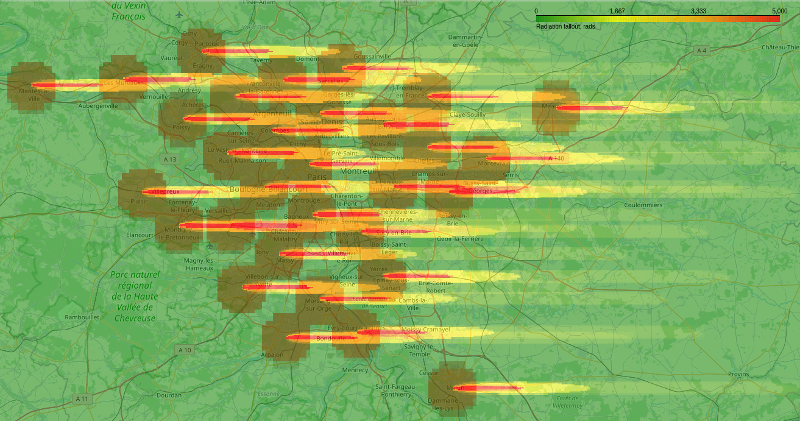

# Population-Loss-NW
Estimate fatalities and loss of industry in the direct aftermath of a nuclear war. Also estimates yield decrease due to loss of agricultural inputs. The code version used in the [paper](https://eartharxiv.org/repository/view/8166/) is the one in the `paper1-release` branch.

## Installation
1. Clone the repo on your local machine.
2. Create the Conda environment using `conda env create -f environment.yml`.
3. Activate the new environment using `conda activate Population-Loss-NW`.
4. (Optional) 
    * Download the `.osm` data to the `data/OSM` directory if you want to use the industrial loss option. It can be downloaded [here](https://drive.google.com/drive/folders/13g6QluVBuEs9fm-nOPzuiYNYdXzB1WiK?usp=drive_link). For more countries, additional files can also be generated using the `data/OSM/extract-industrial-country.sh` script.
    * Download the HD LandScan data to the `data/LandScan` directory if you want to use the HD version of the LandScan data. It can be downloaded [here](https://landscan.ornl.gov/). 
    * Download the Ahvo et al. data to the `data/ahvo` directory if you want to use the agricultural loss option; it can be downloaded [here](https://zenodo.org/records/8381197). 
    * Download the BACI data to the `data/BACI` directory if you want to estimate loss of pesticides; it can be downloaded [here](https://www.cepii.fr/cepii/en/bdd_modele/bdd_modele_item.asp?id=37). 

## Methodology
### Destruction and population loss
Here we use a methodology similar to [Toon et al. 2007](https://acp.copernicus.org/articles/7/1973/2007/acp-7-1973-2007.pdf) and [Toon et al. 2008](https://pubs.aip.org/physicstoday/article/61/12/37/393240/Environmental-consequences-of-nuclear-warA) to estimate the number of fatalities in the aftermath of a nuclear war.

In Hiroshima and Nagasaki data a normal distribution around ground zero was measured for the fatality rate, $\alpha(R) = e^{-\frac{R^2}{2 \sigma^2}}$, where $R$ is the distance from ground zero and $\sigma=1.15$ km for a 15-20 kt airburst. This $\sigma$ has to be scaled up for higher-yield weapons. Toon et al. use a pessimistic square-root scaling, but we use a more realistic scaling here (see `scripts/burn-radius-scaling.ipynb`).

Using [LandScan](https://landscan.ornl.gov/) data for population, we can estimate the number of fatalities in the immediate aftermath of a nuclear war by integrating over the distribution of distances from ground zero.

Targets can be selected by finding for a given country where to detonate a given number of warheads over the country's most populated region and without overlapping targets (following the Toon et al. methodology). For example, here are the results for 50 100-kt non-overlapping strikes on Germany. The areas colored in light red are regions where fatalities are expected from the blasts and ensuing fires and those colored in dark red are regions expected to be burned down. 14 million fatalities are expected in this scenario. Other targeting options currently supported are to maximize the number of fatalities while allowing overlapping targets, and defining the coordinates of the targets (along with a CEP to account for targeting inaccuracy).

 

In addition, industrial zones can be shown in purple or brown if they are burned down by the nuclear explosions. This allows to estimate the loss of industry in the aftermath of a nuclear war by calculating for a given country what fraction of all industrial areas are burned down.

 

Finally, we also calculate the amount of soot emissions in Tg. We use the same relation as [Toon et al. 2008](https://pubs.aip.org/physicstoday/article/61/12/37/393240/Environmental-consequences-of-nuclear-warA) to calculate the amount of soot emitted in a given pixel. However, we also add the condition that a firestorm only occurs if the fuel loading is above 4 g/cm². If a pixel is below this threshold, there is no firestorm and therefore no injection of soot in the stratosphere. Also, we assume that only half of locations that can firestorm based on this single criterion will actually firestorm (this is based on the fact that Hiroshima firestormed but not Nagasaki).

Note that other targeting options are also supported. Currently, there is an option for following the [OPEN-RISOP](https://github.com/davidteter/OPEN-RISOP/tree/main/TARGET%20LAYDOWNS) target list for the US, and an option for following the [declassified 1956 US target list](https://futureoflife.org/resource/us-nuclear-targets/) for Russia and China.

Fatalities due to nuclear fallout from ground bursts can now also be calculated. The methodology is described in [this document](https://docs.google.com/document/d/1stBmeMabT2VQsL-KfVvUlFNzkmfZIK3tQ5-WUUVNldc/edit?usp=sharing). The image below shows an example for 100 kt strikes against Paris. The brown circles are the regions destroyed by fire and the green-yellow-orange-red colors indicate the total radiation accumulated after 48 hours. 500 rads is fatal without protection, but most people would shelter inside (being in a residential basement offers a ~10x protection factor).

 

### Agricultural loss
To translate the loss of industrial capacity into loss of agricultural production, we use the data from [Ahvo et al. 2023](https://doi.org/10.1038/s43016-023-00873-z). First, we calculate the loss of fertilizers and pesticides due to the destruction or disablement of industrial capacity using data for fertilizer and pesticide production by country. Then, we use the data from Ahvo et al. to estimate the loss of agricultural production due to the loss of fertilizers and pesticides. This is done for each country separately assuming that the loss of fertilizers and pesticides applies globally. For each country, we calculate the loss of agricultural production for 12 crops and average these numbers using the number of calories supplied by each crop as weights. We are making the assumption that all yield loss sources are multiplicative.

## Data sources
* [LandScan](https://landscan.ornl.gov/) for population data
* [OSM](https://download.geofabrik.de/) for industrial data
* [BACI](https://www.cepii.fr/CEPII/en/bdd_modele/bdd_modele_item.asp?id=37) for data on pesticides
* [OWID](https://ourworldindata.org/) for agricultural production data and fertilizer data
* [Ahvo et al. 2023](https://doi.org/10.1038/s43016-023-00873-z) for data on yield loss due to input shock

## Limitations
* The code requires quite a bit of RAM if the target country is large. If this is an issue, you can use the `degrade` option to degrade the resolution of the LandScan data. The original resolution is 30 arc-seconds, so the individual pixels are somewhat smaller than 1 km² for the regions most susceptible to nuclear war.

## Codebase orientation
1. Simply use `scripts/nuclear-attack.ipynb` to calculate the number of fatalities and destruction of industrial capacity in a nuclear war given an attack with a given number of warheads against a given country. All the code is in `src/main.py`. `results` contains the number of fatalities and loss of industrial capacity for different scenarios.

2. `scripts/HEMP.ipynb` contains the standalone code to calculate the disablement of industrial capacity due to HEMP. For the scenarios currently considered, EMP effects can be applied separately from the effects of direct destruction of industrial capacity. However, this could change in the future, which would necessitate a more integrated approach. This was avoided at this stage to keep the codebase simple.

3. `scripts/impact-of-loss-of-industry.ipynb` transforms loss of total industrial capacity per country into loss of industrial capacity per sector using the code in `src/sectors.py` and `data/industry-sectors/`. In addition, it also calculates the loss of agricultural production due to loss of fertilizers and pesticides (using the code in `src/inputshock.py`). This script produces the file that can be used as input for the [integrated model](https://github.com/allfed/allfed-integrated-model).

4. The other notebooks in `scripts/` are for the specific scenarios considered so far, all described in these [slides](https://docs.google.com/presentation/d/1MnmQaBrXC9f9iq4tgrjnwuggpzrl4G63ftm2RXDTaWI/edit?usp=drive_link).

## Verification
To verify that the population loss implementation is correct, we can compare to the [results](https://pubs.aip.org/view-large/figure/45882429/37_1_f1.jpg) of Toon et al. Below is a comparison between the number of casualties (in millions) in different scenarios. Note that this includes fatalities and injuries to facilitate the comparison with the results of Toon et al. Everything seems to work ok. Some numbers are significantly higher, but this can be attributed to population increase over the years (India in particular). Note that this verification was performed using the same scaling assumptions as Toon et al. (the default code uses different scaling assumptions).

| Scenario | Toon et al. | This code (Toon assumptions) | 
|----------|----------|----------|
| China, 1100x 100kt | 287 | 314 
| France, 200x 100kt | 23 | 20 | 
| Germany, 200x 100kt | 28 | 27 |
| India, 200x 100kt | 116 | 172 |
| Japan, 200x 100kt | 59 | 50 | 
| Pakistan, 200x 100kt  | 50  |  66 | 
| Russia, 1100x 100kt | 76 | 66 | 
| UK, 200x 100kt | 28 | 29 |
| US, 1000x 100kt | 104 | 108 | 
| **Total** | **771** | **851** |  

And here is a similar comparison for the amount of soot emissions in Tg. Note that for the second column in this table we use the same burn radius prescription as Toon et al., which is different from the default code (see `scripts/burn-radius-scaling.ipynb`).

| Scenario | Toon et al. | This code (Toon assumptions) |
|----------|----------|----------|
| China, 1100x 100kt | 59.5 | 64.9 | 
| France, 200x 100kt | 6.5 | 6.1 |  
| Germany, 200x 100kt | 7.3 | 7.0 |  
| India, 200x 100kt | 21.4 | 33.8 |  
| Japan, 200x 100kt | 11.9 | 11.1 |  
| Pakistan, 200x 100kt | 11.0 | 13.8 |  
| Russia, 1100x 100kt | 26.9 | 23.7 | 
| UK, 200x 100kt | 7.4 | 7.6 |  
| US, 1000x 100kt | 28.1 | 29.7 |  
| **Total** | **180** | **198.5** |  

## Scenarios considered
See theses [slides](https://docs.google.com/presentation/d/1MnmQaBrXC9f9iq4tgrjnwuggpzrl4G63ftm2RXDTaWI/edit?usp=drive_link) for a description of the scenarios considered.
